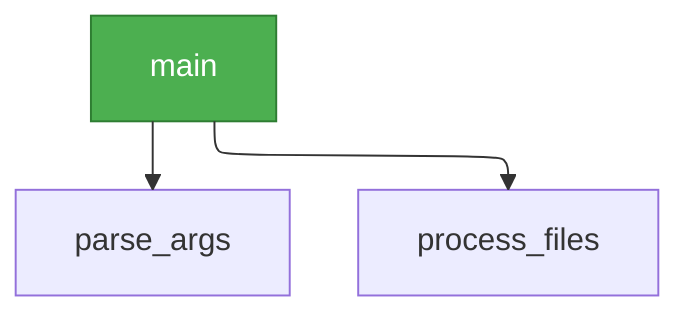

# cflow - Code Flow Visualizer

Visualize function call graphs from entry points through the entire call chain for Python codebases.

## Features

- **Function Call Graph** - Trace execution flow from entry points
- **AST-based Analysis** - Accurate parsing using Python's Abstract Syntax Tree
- **Auto-detect Entry Points** - Finds `main()` and uncalled functions
- **Constructor Detection** - Tracks `ClassName()` calls to `__init__` methods
- **Cross-class Method Resolution** - Resolves `instance.method()` calls across classes
- **Tree Output** - Clean ASCII tree format by default
- **Mermaid Diagrams** - Optional visual diagrams for documentation
- **Recursive Detection** - Identifies recursive function calls

## Supported

| Language | Extension | Parser |
| -------- | --------- | ------ |
| Python   | `.py`     | AST    |

## Quick Start

```bash
# Analyze and output to cflow.md
cflow ./src

# Start from specific entry point
cflow ./src --entry main

# Include Mermaid diagram
cflow ./src --with-mermaid
```

## Usage

```
cflow [OPTIONS] [PATH]
```

### Positional Arguments

| Argument | Description                                 |
| -------- | ------------------------------------------- |
| `path`   | Directory or file to analyze (default: `.`) |

### Options

| Option           | Short | Description                          |
| ---------------- | ----- | ------------------------------------ |
| `--entry FUNC`   | `-e`  | Entry point function (default: auto) |
| `--output FILE`  | `-o`  | Output file (default: `cflow.md`)    |
| `--stdout`       |       | Output to stdout                     |
| `--with-mermaid` |       | Include Mermaid diagram in output    |
| `--max-depth N`  |       | Maximum call depth (default: 10)     |
| `--quiet`        | `-q`  | Suppress progress messages           |
| `--help`         | `-h`  | Show help                            |

## Output Format

### Default: Call Tree

The default output is an ASCII call tree with file locations:

```
main (main.py:45)
|-- parse_args (cli.py:12)
|-- process_files (core.py:28)
|   |-- read_file (io.py:15)
|   `-- analyze (core.py:55)
|       `-- parse_data (parser.py:22)
`-- cleanup (main.py:89)
```

### With Mermaid (`--with-mermaid`)

Adds a visual Mermaid flowchart diagram with ELK layout for better graph visualization:



## Entry Points

### Auto-detection

`cflow` automatically finds entry points:

1. **`main` function** - Highest priority
2. **Uncalled functions** - Functions not called by any other function

### Manual Entry Point

```bash
# Start from main function
cflow ./src --entry main

# Start from class method
cflow ./src --entry MyClass.process
```

## Examples

### Analyze Project

```bash
cflow ./src
```

### Analyze Single File

```bash
cflow ./src/main.py
```

### Generate Documentation

```bash
cflow ./src --entry main --with-mermaid -o docs/call-graph.md
```

### Output to Stdout

```bash
cflow ./src --stdout | head -50
```

### Limit Depth

For large codebases:

```bash
cflow ./src --max-depth 5
```

## Output Example

```markdown
# Call Graph

**Source:** `/path/to/project/src`
**Functions:** 42
**Entry Points:** 3
**Call Edges:** 67

## Call Tree

\`\`\`
main (main.py:45)
|-- init_config (config.py:12)
|-- run_server (server.py:28)
| |-- handle_request (handler.py:15)
| `-- send_response (handler.py:55)
`-- cleanup (main.py:89)
\`\`\`

## Call Graph Diagram

## \`\`\`mermaid

config:
layout: elk

---

flowchart TD
main["main"]:::entry
...
\`\`\`
```

## Limitations

- **Static analysis only** - Cannot detect dynamic calls (e.g., `getattr(obj, method_name)()`)
- **Method resolution heuristics** - When multiple classes have the same method name, the first match is used
- **Nested functions** - Decorator-defined nested functions (e.g., `@decorator def func():`) may not be fully tracked

## Ignored Directories

Automatically excluded:

- `.git`, `.svn`, `.hg`
- `__pycache__`
- `.venv`, `venv`, `.env`, `env`
- `.tox`, `.nox`, `.mypy_cache`, `.pytest_cache`, `.ruff_cache`
- `dist`, `build`
